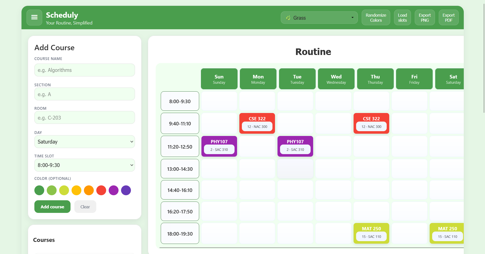

# 📅 Scheduly

**Your Routine, Simplified**

---

A simple and intuitive web application for **creating and managing class schedules**.
This tool helps students and educators organize their weekly routines with ease.

---

## 🚀 Live Demo

👉 [Click here to try Scheduly!](https://rmia46.github.io/scheduly/)

---

## 🛠️ How to Use

1. ⏰ **Add Time Slots:** Use the *Add Time Slot* section to create your desired time slots.
2. 📚 **Add Courses:** Fill in the course details in the *Add Course* section and click *Add course*.
3. 🖱️ **Arrange Your Routine:** Drag and drop the courses on the timetable to arrange your schedule.
4. 🎨 **Customize:** Choose a theme, randomize colors, and name your routine.
5. 💾 **Export:** Click *Export PNG* or *Export PDF* to save your routine.

---

## ✨ Features

* ⏱️ **Customizable Time Slots** – Add, remove, and sort time slots.
* 📖 **Course Management** – Add, edit, and delete courses with details like name, section, and room.
* 🔄 **Interactive Timetable** – Drag & drop courses across slots.
* 🎨 **Multiple Themes** – Personalize your routine’s look & feel.
* 🌈 **Color-Coded Courses** – Assign or randomize course colors.
* 📤 **Export Options** – Save as **PNG** or **PDF**.
* 💾 **Persistent Storage** – Auto-saved to browser’s local storage.
* 🏷️ **Custom Routine Name** – Organize multiple schedules easily.
* 📱 **Responsive Design** – Works smoothly on desktop & mobile.

---

## 📊 Stats & Insights

---

