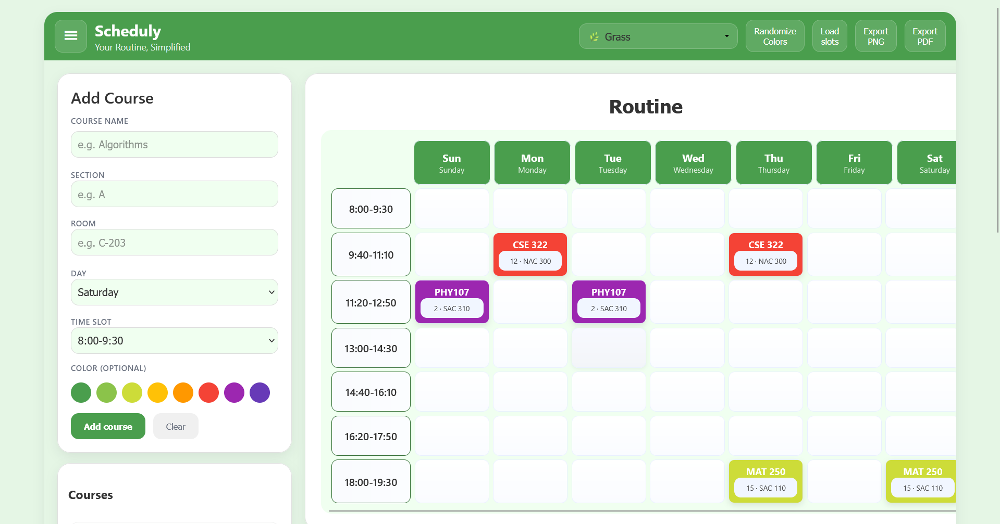

# 📅 Scheduly

**Your Routine, Simplified**

---

A simple and intuitive web application for **creating and managing class schedules**.
This tool helps students and educators organize their weekly routines with ease.

---

## Live Demo

👉 [Click here to try Scheduly!](https://rmia46.github.io/scheduly/)

---

## How to Use

1. **Add Time Slots:** Use the *Add Time Slot* section to create your desired time slots.
2. **Add Courses:** Fill in the course details in the *Add Course* section and click *Add Course*.
3. **Arrange Your Routine:** Drag and drop courses on the timetable to organize your schedule, with visual feedback for drop locations.
4. **Edit & Delete Courses:**

   * **Single click** a course block to select it and reveal the **Delete** button.
   * **Double click / tap** a course block to open edit mode and update details.
5. **Customize:** Choose a theme (including the new **Grape** theme), randomize colors, and name your routine.
6. **Export:** Use the **Export** dropdown to save your routine as **PNG** or **PDF**.

---

## Features

* **Customizable Time Slots** – Add, remove, sort, and load default time slots.
* **Course Management** – Add, edit, and delete courses with details like name, section, and room.
* **Interactive Timetable** – Drag and drop courses across slots with visual feedback for drop locations.
* **Visual Feedback** – Highlight selected course blocks and drop targets.
* **Multiple Themes** – Personalize your routine’s appearance, including the new **Grape** theme.
* **Color-Coded Courses** – Assign or randomize course colors.
* **Export Options** – Save schedules as **PNG** or **PDF** through a convenient export menu.
* **Persistent Storage** – Automatically saved to browser local storage.
* **Multiple Routine Support** – Create and manage multiple schedules easily.
* **Responsive Design** – Works smoothly on desktop and mobile devices.
* **Clean UI** – Grouped header actions for a less cluttered interface.
